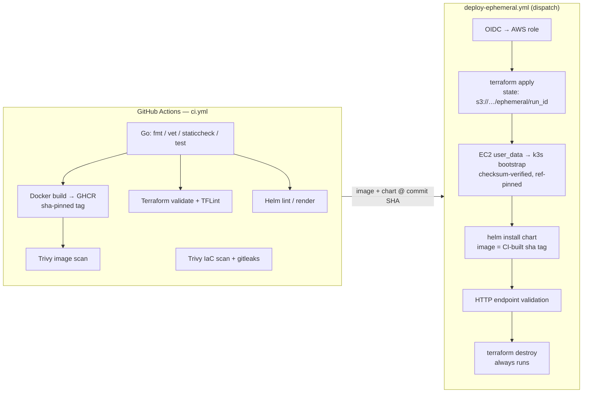
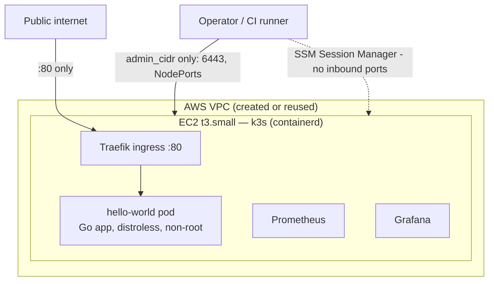

# CI/CD Pipeline: GitHub Actions → Terraform → k3s on AWS

[](https://github.com/mattshogi/CI-CD_terraform_k3s_aws/actions/workflows/ci.yml)
[](LICENSE)
[](https://www.terraform.io/)

End-to-end demonstration of modern platform engineering: a Go service is
built, tested, scanned, containerized, and deployed onto an ephemeral
single-node Kubernetes (k3s) cluster on AWS — provisioned by Terraform,
validated over HTTP, and torn down automatically. Design decisions and
trade-offs are documented in [DESIGN.md](DESIGN.md).

## Architecture





**Security posture:** only the web ports (80, and 443 when TLS is on) are
public. SSH, the Kubernetes API, and NodePorts are restricted to `admin_cidr`
(closed entirely by default); day-to-day access is AWS SSM Session Manager,
which needs no inbound rules. IMDSv2 is enforced, the root volume is
encrypted, VPC flow logs ship to CloudWatch, containers run non-root from a
distroless image, and the Grafana password lives in SSM Parameter Store —
never in code or logs.

### Feature flags

| Terraform variable | Default | Effect |
| --- | --- | --- |
| `enable_tls` | `true` | cert-manager + self-signed ClusterIssuer; HTTPS at `https://<ip>.sslip.io/` (swap the issuer for Let's Encrypt with a real domain) |
| `enable_monitoring` | `false` (CI: `true`) | kube-prometheus-stack; Grafana password in SSM Parameter Store |
| `enable_gitops` | `false` | Flux `GitRepository` + `HelmRelease` reconciles the chart from this repo instead of push-time `helm install` |
| `use_baked_ami` | `false` | Boot from the latest Packer-baked `k3s-node-*` AMI (pre-installed k3s/images/helm) instead of stock Ubuntu |
| `admin_cidr` | `""` (closed) | CIDR allowed on SSH/6443/NodePorts; CI sets the runner IP |

## Repository layout

```text
├── app/                    # Go HTTP service + tests + distroless Dockerfile
├── charts/hello-world/     # Helm chart — the single deployment definition
├── cluster/                # EC2 user_data + k3s bootstrap (checksum-verified)
├── infra/                  # Terraform root (S3 remote state, partial config)
│   ├── modules/network/    #   VPC, public subnet, routing, flow logs
│   ├── modules/k3s-node/   #   hardened EC2 + locked-down security group
│   └── bootstrap/github-oidc/  # one-time: OIDC provider + CI deploy role
├── packer/                 # Pre-baked k3s node AMI template
├── scripts/                # State bootstrap, endpoint/cluster validation, SSM diagnostics
└── .github/workflows/      # ci.yml · deploy-ephemeral.yml · bake-ami.yml · release.yml
```

## Quick start (local)

Prerequisites: AWS CLI with credentials, Terraform ≥ 1.11.

```bash
git clone https://github.com/mattshogi/CI-CD_terraform_k3s_aws.git
cd CI-CD_terraform_k3s_aws

# 1. One-time: create the remote-state bucket (versioned, encrypted)
./scripts/bootstrap_remote_state.sh

# 2. Configure (all optional — see comments in the example file)
cp infra/terraform.tfvars.example infra/terraform.tfvars
# set admin_cidr to your IP if you want kubectl/NodePort access

# 3. Deploy
terraform -chdir=infra init -backend-config=backend.hcl
terraform -chdir=infra apply

# 4. Validate & explore
IP=$(terraform -chdir=infra output -raw server_public_ip)
./scripts/validate_endpoints.sh "$IP"
aws ssm start-session --target "$(terraform -chdir=infra output -raw server_instance_id)"

# 5. Tear down
terraform -chdir=infra destroy
```

## CI/CD setup (GitHub Actions)

One-time bootstrap, in order:

1. **State bucket** — `./scripts/bootstrap_remote_state.sh`, then set repo
   **variable** `TF_STATE_BUCKET` to the bucket name.
2. **OIDC role** (recommended; no long-lived keys in GitHub):

   ```bash
   terraform -chdir=infra/bootstrap/github-oidc init
   terraform -chdir=infra/bootstrap/github-oidc apply -var="state_bucket=<bucket>"
   ```

   Set the `role_arn` output as repo **variable** `AWS_ROLE_ARN`.
   (Fallback: `AWS_ACCESS_KEY_ID`/`AWS_SECRET_ACCESS_KEY` secrets.)
3. Optionally set variable `AWS_REGION` (default `us-east-1`).

### Workflows

| Workflow | Trigger | What it does |
| --- | --- | --- |
| `ci.yml` | push / PR | Test, lint (Go/Terraform/Helm/Packer), build+push image, Trivy (image + IaC, gates on HIGH+), gitleaks, integration tests |
| `deploy-ephemeral.yml` | manual dispatch | Provision → validate → destroy; per-run S3 state key; deploys the CI-built image for the exact commit; TLS/GitOps/baked-AMI toggles |
| `bake-ami.yml` | manual dispatch | Packer-builds the pre-baked `k3s-node-*` AMI |
| `release.yml` | `v*` tag | Multi-arch semver images + GitHub release with binaries |

The ephemeral deploy always destroys by default (`keep_after_validate=false`).
Because state is remote and keyed per run (`ephemeral/<run_id>.tfstate`), a
crashed run leaves recoverable state — re-run destroy against that key rather
than hunting orphaned resources in the console.

## Services

| Service | Access | Notes |
| --- | --- | --- |
| Hello World | `http://<ip>/` | public (Traefik ingress) |
| Hello World (TLS) | `https://<ip>.sslip.io/` | public; self-signed issuer, so `curl -k` / browser warning expected |
| Hello World (NodePort) | `http://<ip>:30080/` | `admin_cidr` only |
| Grafana | `http://<ip>:30030/` | `admin_cidr` only; password: `aws ssm get-parameter --name "$(terraform -chdir=infra output -raw grafana_password_ssm_parameter)" --with-decryption --query Parameter.Value --output text` |
| Prometheus | `http://<ip>:30900/` | `admin_cidr` only |

## Cost notes

- `t3.micro` suffices for cluster + app; use `t3.small`+ with monitoring
  (kube-prometheus-stack needs the memory).
- Single node, no NAT gateway, no load balancer — a few cents per
  ephemeral run.
- Ephemeral runs self-destroy; for anything kept, `terraform destroy` when done.

## Troubleshooting

| Symptom | Check |
| --- | --- |
| Instance up, app not responding | `aws ssm start-session --target <instance-id>`, then `tail -f /var/log/cloud-init-output.log` and `journalctl -u k3s` |
| `kubectl` from your machine fails | Is your IP in `admin_cidr`? Port 6443 is closed otherwise |
| CI deploy fails fast | `TF_STATE_BUCKET` / `AWS_ROLE_ARN` repo variables set? |
| Image pull fails on instance | Bootstrap falls back to `hashicorp/http-echo` automatically; check GHCR package visibility is public |
| Monitoring pods pending / OOM | Use `t3.small` or larger |

## Development

```bash
cd app
go test -race ./...        # unit tests
go run .                   # serves :5678 (PORT env to override)
docker build -t hello-local . && docker run -p 5678:5678 hello-local
```

`./scripts/test-integration.sh` runs the CI integration suite locally
(Terraform validate, Docker build, container smoke test, Helm lint).

## License

[MIT](LICENSE)
