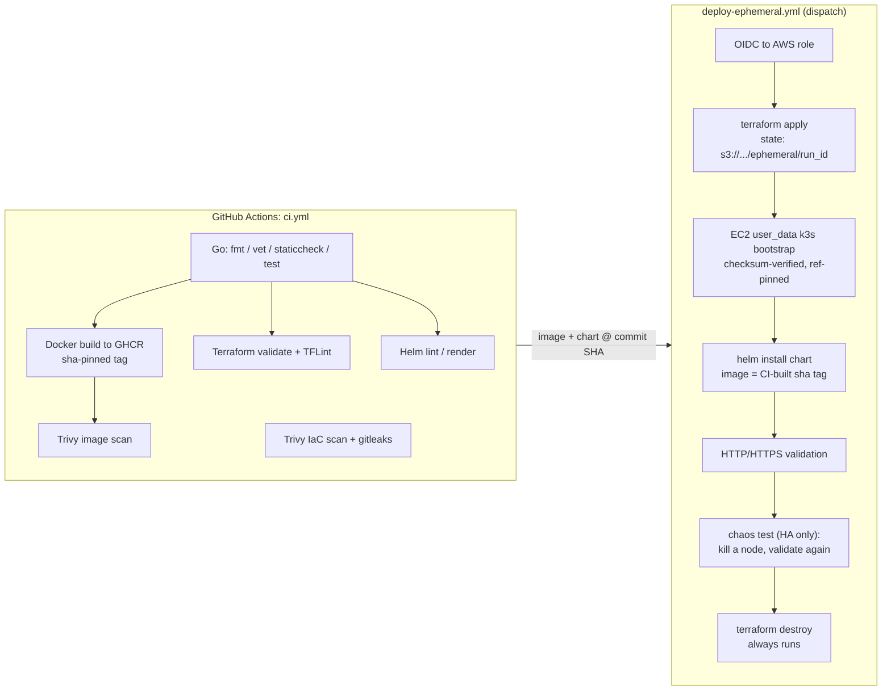
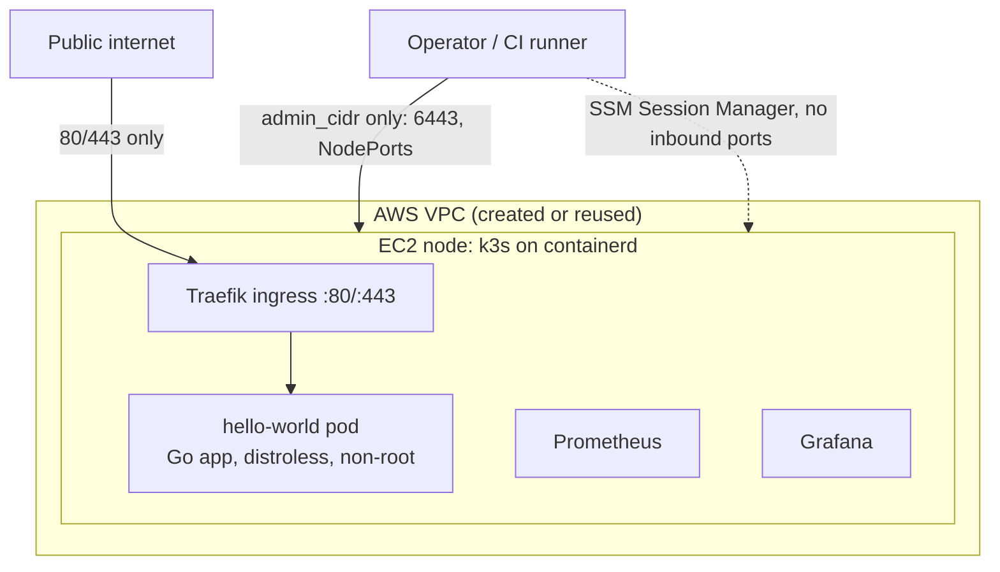
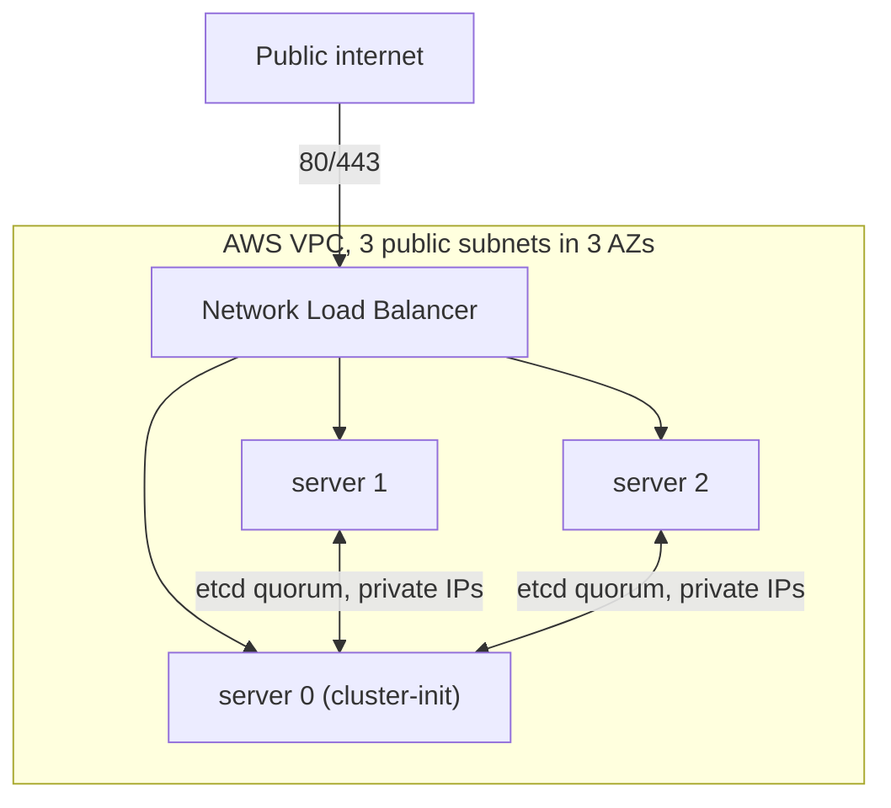

# CI/CD Pipeline: GitHub Actions to Terraform to k3s on AWS

[](https://github.com/mattshogi/CI-CD_terraform_k3s_aws/actions/workflows/ci.yml)
[](LICENSE)
[](https://www.terraform.io/)

This repo is a working, end-to-end platform engineering demo. A small Go
service gets built, tested, scanned, and containerized, then deployed onto an
ephemeral k3s cluster on AWS that Terraform provisions, validates over HTTP,
and tears down when it's done. By default that cluster is a single cheap
node. Flip one flag (`ha_mode`) and it becomes a three-server, three-AZ
cluster with embedded etcd behind a network load balancer, and the deploy
pipeline proves the HA claim by terminating one of its own nodes mid-run and
checking that the service keeps answering.

Every non-obvious choice has a written rationale in [DESIGN.md](DESIGN.md),
currently 14 decision records.

## Architecture



Default topology, one node:



With `ha_mode = true`, three servers across three availability zones form an
embedded etcd cluster (quorum survives losing one node), and a network load
balancer becomes the stable entry point:



**Security posture.** Only the web ports (80, plus 443 when TLS is on) face
the internet, in both topologies. The Kubernetes API is never behind the load
balancer: HA servers join over the primary's private IP, cluster traffic
(etcd, VXLAN, kubelet) is limited to self-referencing security group rules,
and the join token lives in SSM Parameter Store. SSH and NodePorts open only
to `admin_cidr`, which is closed by default, because SSM Session Manager
covers day-to-day access without any inbound rules. IMDSv2 is enforced, root
volumes are encrypted, VPC flow logs ship to CloudWatch, containers run
non-root from a distroless image, and the Grafana password stays in SSM
Parameter Store rather than code or logs.

### Feature flags

| Terraform variable | Default | Effect |
| --- | --- | --- |
| `ha_mode` | `false` | 3 k3s servers across 3 AZs, embedded etcd, NLB entry point. The deploy workflow terminates a node and re-validates. Use `t3.medium`. See [DESIGN.md #14](DESIGN.md) |
| `enable_tls` | `true` | cert-manager with a self-signed ClusterIssuer. HTTPS at `https://<ip>.sslip.io/` (single node) or the NLB hostname (HA). Swap the issuer for Let's Encrypt once you have a real domain |
| `enable_monitoring` | `false` (CI: `true`) | kube-prometheus-stack, with the Grafana password in SSM Parameter Store |
| `enable_gitops` | `false` | Flux reconciles the chart from this repo (GitRepository + HelmRelease) instead of a push-time `helm install` |
| `use_baked_ami` | `false` | Boot from the latest Packer-baked `k3s-node-*` AMI (k3s, images, and helm pre-installed) instead of stock Ubuntu |
| `admin_cidr` | `""` (closed) | CIDR allowed on SSH/6443/NodePorts. CI sets the runner's IP |

## Repository layout

```text
├── app/                    # Go HTTP service, tests, distroless Dockerfile
├── charts/hello-world/     # Helm chart, the single deployment definition
├── cluster/                # EC2 user_data + k3s bootstrap (checksum-verified)
├── infra/                  # Terraform root (S3 remote state, partial config)
│   ├── modules/network/    #   VPC, per-AZ public subnets, routing, flow logs
│   ├── modules/k3s-node/   #   hardened EC2 + locked-down security group
│   ├── modules/nlb/        #   network LB fronting the HA servers (80/443)
│   └── bootstrap/github-oidc/  # one-time: OIDC provider, CI deploy role, ELB service-linked role
├── packer/                 # Pre-baked k3s node AMI template
├── scripts/                # State bootstrap, endpoint/cluster validation, SSM diagnostics
└── .github/workflows/      # ci.yml, deploy-ephemeral.yml, bake-ami.yml, release.yml
```

## Quick start (local)

You'll need the AWS CLI with credentials and Terraform 1.11 or newer.

```bash
git clone https://github.com/mattshogi/CI-CD_terraform_k3s_aws.git
cd CI-CD_terraform_k3s_aws

# 1. One-time: create the remote-state bucket (versioned, encrypted)
./scripts/bootstrap_remote_state.sh

# 2. Configure. Everything is optional; the example file explains each knob.
cp infra/terraform.tfvars.example infra/terraform.tfvars
# set admin_cidr to your IP if you want kubectl/NodePort access
# set ha_mode = true for the 3-node cluster (use instance_type = "t3.medium")

# 3. Deploy
terraform -chdir=infra init -backend-config=backend.hcl
terraform -chdir=infra apply

# 4. Validate and explore. endpoint_host is the instance IP, or the NLB
#    hostname in HA mode, so the same command works for both.
./scripts/validate_endpoints.sh "$(terraform -chdir=infra output -raw endpoint_host)"
aws ssm start-session --target "$(terraform -chdir=infra output -raw server_instance_id)"

# 5. Tear down
terraform -chdir=infra destroy
```

## CI/CD setup (GitHub Actions)

One-time bootstrap, in order:

1. **State bucket**: run `./scripts/bootstrap_remote_state.sh`, then set the
   repo **variable** `TF_STATE_BUCKET` to the bucket name.
2. **OIDC role** (recommended, so no long-lived keys sit in GitHub):

   ```bash
   terraform -chdir=infra/bootstrap/github-oidc init
   terraform -chdir=infra/bootstrap/github-oidc apply -var="state_bucket=<bucket>"
   ```

   Set the `role_arn` output as the repo **variable** `AWS_ROLE_ARN`. This
   apply also creates the ELB service-linked role, which AWS requires before
   an account's first load balancer, so the CI role never needs that IAM
   power itself. (Fallback: `AWS_ACCESS_KEY_ID`/`AWS_SECRET_ACCESS_KEY`
   secrets.)
3. Optionally set the variable `AWS_REGION` (defaults to `us-east-1`).

### Workflows

| Workflow | Trigger | What it does |
| --- | --- | --- |
| `ci.yml` | push / PR | Tests and lints everything (Go, Terraform, Helm, Packer), builds and pushes the image, scans it with Trivy, scans the IaC (gates on HIGH+), runs gitleaks and integration tests |
| `deploy-ephemeral.yml` | manual dispatch | Provision, validate, destroy. Per-run S3 state key; deploys the CI-built image for the exact commit. Toggles for TLS, GitOps, baked AMI, and HA. HA runs include the chaos test |
| `bake-ami.yml` | manual dispatch | Builds the pre-baked `k3s-node-*` AMI with Packer |
| `release.yml` | `v*` tag | Multi-arch semver images plus a GitHub release with binaries |

The ephemeral deploy destroys everything by default. Because state is remote
and keyed per run (`ephemeral/<run_id>.tfstate`), even a crashed run leaves
recoverable state behind, so cleanup is a destroy against that key instead
of a hunt through the console.

## Services

| Service | Access | Notes |
| --- | --- | --- |
| Hello World | `http://<host>/` | public, via Traefik ingress. `<host>` is the instance IP, or the NLB hostname in HA mode (the `endpoint_host` output) |
| Hello World (TLS) | `https://<ip>.sslip.io/` or `https://<nlb-hostname>/` | public; the issuer is self-signed, so expect `curl -k` or a browser warning |
| Hello World (NodePort) | `http://<ip>:30080/` | `admin_cidr` only |
| Grafana | `http://<ip>:30030/` | `admin_cidr` only; password: `aws ssm get-parameter --name "$(terraform -chdir=infra output -raw grafana_password_ssm_parameter)" --with-decryption --query Parameter.Value --output text` |
| Prometheus | `http://<ip>:30900/` | `admin_cidr` only |

## Cost notes

- `t3.micro` covers the bare cluster and app. Use `t3.small` or bigger once
  monitoring is on, since kube-prometheus-stack needs the memory.
- Stacking monitoring, TLS, and GitOps on one node exceeds t3.small's 2GB.
  It passes validation, then degrades minutes later (we observed apiserver
  TLS handshake timeouts and pod evictions). Use `t3.medium` for the full
  stack.
- A single-node run costs a few cents: one instance, no NAT gateway, no load
  balancer.
- An HA run is roughly 3x the instance cost plus the NLB, still well under a
  dollar for a typical 25-minute dispatch. Left running, 3x t3.medium plus
  the NLB lands around $110/month, which is why `ha_mode` defaults to off.
- Ephemeral runs clean up after themselves. If you keep one, remember
  `terraform destroy`.

## Troubleshooting

| Symptom | Check |
| --- | --- |
| Instance up, app not responding | `aws ssm start-session --target <instance-id>`, then `tail -f /var/log/cloud-init-output.log` and `journalctl -u k3s` |
| `kubectl` from your machine fails | Is your IP in `admin_cidr`? Port 6443 is closed otherwise |
| CI deploy fails fast | Are the `TF_STATE_BUCKET` / `AWS_ROLE_ARN` repo variables set? |
| Image pull fails on the instance | The bootstrap falls back to `hashicorp/http-echo` automatically; check that the GHCR package is public |
| Monitoring pods pending / OOM | Use `t3.small` or larger; `t3.medium` when several flags are stacked |
| Node healthy at first, API timeouts later | Memory exhaustion. See cost notes; check `free -m` over SSM and size up |
| HA joiner never joins | From the joiner (SSM): can it reach `https://<primary-private-ip>:6443/ping`? Check the join token in SSM Parameter Store and the security group's self-referencing rules |
| Chaos test fails | Check NLB target health (`aws elbv2 describe-target-health`) and whether the surviving nodes still hold etcd quorum (`k3s kubectl get nodes` over SSM) |

## Development

```bash
cd app
go test -race ./...        # unit tests
go run .                   # serves :5678 (PORT env to override)
docker build -t hello-local . && docker run -p 5678:5678 hello-local
```

`./scripts/test-integration.sh` runs the CI integration suite locally
(Terraform validate, Docker build, container smoke test, Helm lint).

## License

[MIT](LICENSE)
